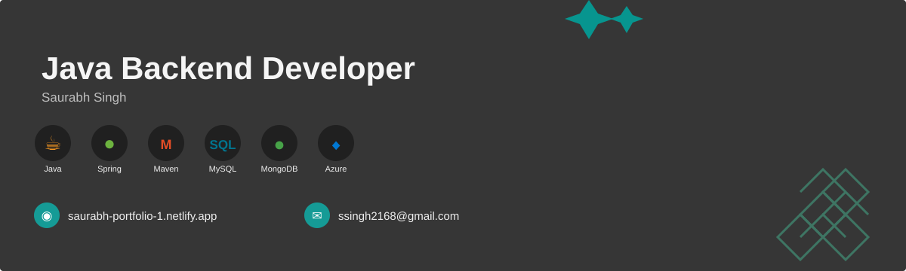

  

-------------------------------------------------------------------------------------------------------------------------------------------------------------------

 

## About me 👋

- 🎓 Studied **M.Sc. in Computer Science**
- ☕ **Java Backend Developer** focused on reliable and scalable applications
- 🌱 Currently learning **Spring Boot, JPA, Hibernate & System Design**
- ☁️ Exploring **Microsoft Azure, Docker, Linux & CI/CD**
- 🗄️ Working with **MySQL, MongoDB, PostgreSQL & SQLite**
- 💻 Interested in **Backend Engineering, Cloud & Software Architecture**
- 📍 Based in **Pune, Maharashtra, India**

-------------------------------------------------------------------------------------------------------------------------------------------------------------------

---

## Tech Stack 🛠️

  

